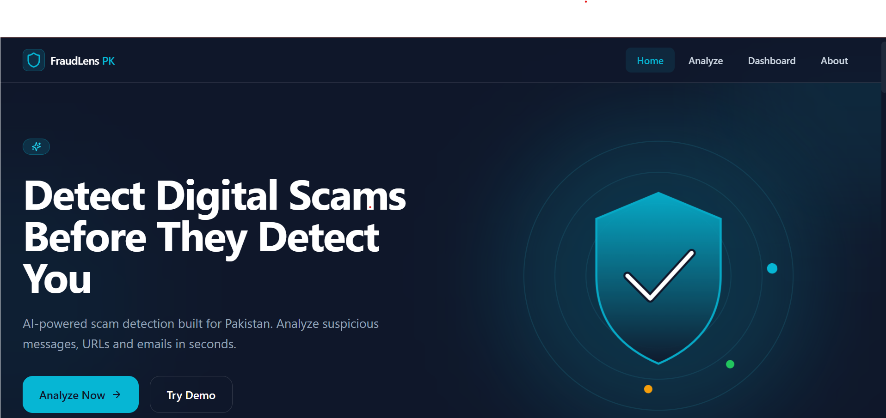

<div align="center">



# 🛡️ FraudLens PK

### AI Digital Scam Shield for Pakistan

<p>
Detect Digital Scams Before They Detect You
</p>

</div>
<div align="center">

# 🛡️ FraudLens PK - AI Digital Scam Shield for Pakistan


### 🇵🇰 Detect Digital Scams Before They Detect You

**FraudLens PK** is an AI-powered cybersecurity platform built specifically for Pakistan to help users identify fraudulent messages, phishing URLs, fake job offers, parcel scams, OTP fraud, banking scams, and social engineering attacks before they become victims.

Rather than simply telling users whether something is suspicious, FraudLens PK explains **why** it is dangerous, highlights the detected red flags, assigns a risk score, classifies the scam type, and provides safe actions in both **English** and **Roman Urdu**.

> 💡 **Hackathon Project | AI for Social Good | Cybersecurity | Scam Detection**

</div>

---

# 📑 Table of Contents

- [📌 About FraudLens PK](#-about-fraudlens-pk)
- [🚨 Problem Statement](#-problem-statement)
- [🎯 Target Users](#-target-users)
- [✨ Key Features](#-key-features)
- [🧠 AI Detection Pipeline](#-ai-detection-pipeline)
- [🛡️ Scam Categories](#️-scam-categories)
- [📱 Responsive Design](#-responsive-design)
- [🖥️ Application Workflow](#️-application-workflow)
- [⚙️ Technology Stack](#️-technology-stack)
- [📂 Project Structure](#-project-structure)
- [🚀 Installation](#-installation)
- [🔑 Environment Variables](#-environment-variables)
- [▶️ Running Locally](#️-running-locally)
- [🏗️ System Architecture](#️-system-architecture)
- [📊 Dashboard](#-dashboard)
- [📄 Report Generation](#-report-generation)
- [🔐 Security Concepts](#-security-concepts)
- [🌱 Future Scope](#-future-scope)
- [🤝 Team Contributors](#-team-contributors)
- [👩‍💻 Author](#-author)
- [📜 License](#-license)

---

# 📌 About FraudLens PK

FraudLens PK is an AI-assisted cybersecurity web application designed to help people across Pakistan recognize and avoid digital scams.

Every day thousands of users receive suspicious WhatsApp messages, SMS alerts, fake banking notifications, phishing emails, fraudulent parcel delivery messages, fake investment opportunities, and fake job offers. Many victims fail to recognize these scams because existing cybersecurity tools focus on blocking threats instead of explaining them in simple language.

FraudLens PK bridges this gap by combining **Artificial Intelligence**, **rule-based scam detection**, and **user-friendly explanations** to make cybersecurity understandable for everyone.

Instead of acting like a generic chatbot, the platform generates a structured security analysis including:

- AI Risk Score
- Scam Category
- Suspicious Indicators (Red Flags)
- English Explanation
- Roman Urdu Explanation
- Safe Action Checklist
- Report Generation
- Dashboard History

The current prototype demonstrates the complete end-to-end workflow using structured mock data while supporting seamless future integration with real AI APIs and backend services.

---

# 🚨 Problem Statement

Digital fraud has become one of the fastest-growing cybersecurity challenges in Pakistan.

People regularly receive:

- Fake banking alerts
- OTP verification scams
- WhatsApp impersonation attacks
- Fake parcel delivery messages
- Investment fraud
- Scholarship scams
- Fake job offers
- Prize-winning scams
- QR code scams
- Phishing websites
- Social media impersonation

Most victims cannot identify technical warning signs such as:

- Suspicious URLs
- Urgent payment requests
- Fake verification messages
- Account suspension threats
- Fake customer support numbers
- Emotional manipulation
- Social engineering tactics

Current cybersecurity tools primarily focus on blocking threats rather than educating users.

FraudLens PK solves this challenge by translating complex cybersecurity analysis into clear, actionable guidance that everyday users can easily understand.

---

# 🎯 Target Users

FraudLens PK is designed for everyone—not just cybersecurity professionals.

### 👨‍🎓 Students

- Fake internship scams
- Scholarship fraud
- Fake university emails
- Job portal scams

---

### 👩‍💼 Professionals

- Business email compromise
- Fake invoices
- Payment fraud
- Phishing emails

---

### 👴 Senior Citizens

- Banking scams
- OTP fraud
- Lottery scams
- Impersonation attacks

---

### 🛒 Online Shoppers

- Fake parcel tracking
- Payment confirmation scams
- Fake delivery websites

---

### 🏦 Banking Users

- Easypaisa scams
- JazzCash scams
- Bank verification fraud
- Fake account suspension messages

---

# ✨ Key Features

| Module | Description |
|---------|-------------|
| 📝 Scam Message Scanner | Analyze suspicious WhatsApp, SMS and Email messages |
| 🌐 URL Scanner | Detect phishing and malicious URLs |
| 📷 Screenshot Scanner | OCR support for screenshots containing scam messages |
| 🤖 AI Risk Analysis | AI-assisted scam detection and explanation |
| 📊 Risk Score | Low, Medium or High risk with confidence percentage |
| 🚨 Scam Type Detection | Automatically classify scam category |
| 🔍 Red Flag Detection | Highlight suspicious keywords and patterns |
| 🌍 English + Roman Urdu | Explain risks in user-friendly language |
| ✅ Safe Action Checklist | Recommend safe next steps |
| 📊 Dashboard | View previous scan history and statistics |
| 📄 Report Generation | Generate detailed security reports |
| 💾 History Storage | Save analyses for future reference |
| 📈 Risk Distribution | Dashboard analytics and visualization |
| 🎨 Modern UI | Responsive cybersecurity-inspired interface |

---

# 🧠 AI Detection Pipeline

FraudLens PK combines traditional rule-based cybersecurity analysis with Artificial Intelligence.

Instead of relying entirely on AI, the platform follows a hybrid approach that improves transparency and explainability.

```text
User Input
(Text • URL • Screenshot)
          │
          ▼
Input Validation
          │
          ▼
OCR (if Screenshot)
          │
          ▼
Rule-Based Detection
          │
          ▼
AI Classification
          │
          ▼
Risk Score Calculation
          │
          ▼
Scam Category Detection
          │
          ▼
Red Flag Extraction
          │
          ▼
English + Roman Urdu Explanation
          │
          ▼
Safe Action Suggestions
          │
          ▼
Dashboard History
          │
          ▼
Report Generation
```

---

# 🛡️ Scam Categories

FraudLens PK can identify various categories of digital scams including:

- 🔐 OTP Fraud
- 🎣 Phishing Attacks
- 💼 Fake Job Scams
- 📦 Parcel Delivery Fraud
- 💳 Banking Scams
- 💰 Investment Fraud
- 🎁 Prize & Lottery Scams
- 👤 Identity Theft
- 💸 Fake Payment Requests
- 📱 WhatsApp Impersonation
- 📧 Email Phishing
- 🌐 Fake Websites
- 📲 QR Code Scams
- 🛒 E-commerce Fraud
- 💹 Cryptocurrency Scams

---

# 📱 Responsive Design

FraudLens PK provides a fully responsive experience across all modern devices.

Supported Devices:

- 💻 Desktop
- 🖥️ Large Screens
- 💼 Laptops
- 📱 Smartphones
- 📟 Tablets

The interface is designed using modern UI principles with accessibility, responsiveness, and usability in mind.

---

# 🖥️ Application Workflow

```text
Landing Page
      │
      ▼
Analyze Page
      │
      ▼
Paste Message / URL / Upload Screenshot
      │
      ▼
AI + Rule-Based Risk Analysis
      │
      ▼
Risk Score
      │
      ▼
Detected Scam Type
      │
      ▼
Red Flags
      │
      ▼
English & Roman Urdu Explanation
      │
      ▼
Safe Action Checklist
      │
      ▼
Dashboard History
      │
      ▼
Generate Report
```

---

# ⚙️ Technology Stack

## 🎨 Frontend

| Technology | Purpose |
|------------|---------|
| Next.js | React Framework |
| React | Component-based UI |
| Tailwind CSS | Utility-first Styling |
| shadcn/ui | Reusable UI Components |
| Framer Motion | Animations |
| Lucide React | Icons |

## 🤖 AI

| Technology | Purpose |
|------------|---------|
| OpenAI API | Scam Classification |
| Google Gemini | Risk Analysis |
| OCR Engine | Screenshot Text Extraction |

## ⚙️ Backend

| Technology | Purpose |
|------------|---------|
| Next.js API Routes | Backend APIs |
| Node.js Runtime | Server Environment |

## 🗄️ Database

| Technology | Purpose |
|------------|---------|
| Supabase | Scan History |
| Firebase | Cloud Storage |

## 🚀 Deployment

| Platform | Purpose |
|----------|---------|
| Vercel | Frontend Hosting |
| GitHub | Version Control |

---
# 📂 Project Structure

```text
FraudLens-PK/
│
├── app/
│   ├── analyze/
│   ├── dashboard/
│   ├── report/
│   ├── globals.css
│   ├── layout.js
│   └── page.js
│
├── components/
│   ├── analyzer/
│   ├── dashboard/
│   ├── landing/
│   ├── report/
│   ├── shared/
│   └── ui/
│
├── assets
│   └── banner.png
├── .github
├── docs/
│   ├── AI_PROMPT.md
│   ├── PROJECT_PLAN.md
│   ├── TEAM_TASKS.md
│   └── DEMO_SCAM_CASES.md
│
├── package.json
├── package-lock.json
└── README.md
```

---

# 🚀 Installation

## Clone Repository

```bash
git clone https://github.com/MaryamChanzeb/FraudLens-Pk.git
```

Navigate to the project folder

```bash
cd FraudLens-Pk
```

Install dependencies

```bash
npm install
```

---

# 🔑 Environment Variables

Create a `.env.local` file in the root directory.

```env
NEXT_PUBLIC_APP_NAME=FraudLens PK

OPENAI_API_KEY=your_openai_api_key

GEMINI_API_KEY=your_gemini_api_key

SUPABASE_URL=your_supabase_url

SUPABASE_ANON_KEY=your_supabase_key

FIREBASE_API_KEY=your_firebase_key
```

> **Note:** The current prototype demonstrates the complete end-to-end workflow using structured mock data. Environment variables will be required once AI APIs and backend services are fully integrated.

---

# ▶️ Running Locally

Start the development server

```bash
npm run dev
```

Open your browser and visit

```
http://localhost:3000
```

To build for production

```bash
npm run build
```

Start production server

```bash
npm start
```

---

# 🏗️ System Architecture

```text
                   User
                     │
                     ▼
            Next.js Frontend
                     │
                     ▼
        Analyzer Interface (UI)
                     │
                     ▼
        Rule-Based Detection Engine
                     │
                     ▼
         AI Classification Layer
         (OpenAI / Gemini API)
                     │
                     ▼
          Risk Analysis Engine
                     │
      ┌──────────────┼──────────────┐
      ▼              ▼              ▼
 Risk Score     Scam Category    Red Flags
      │              │              │
      └──────────────┼──────────────┘
                     ▼
         English + Roman Urdu
             Explanation
                     │
                     ▼
         Safe Action Checklist
                     │
         ┌───────────┴───────────┐
         ▼                       ▼
 Dashboard History        Report Generator
                     │
                     ▼
        Supabase / Firebase Storage
```

---

# 📊 Dashboard

The Dashboard provides users with an overview of previous scam analyses and overall risk statistics.

### Dashboard Features

- 📈 Risk Distribution Chart
- 📋 Scan History
- 🚩 Frequently Detected Scam Types
- 📊 Total Scans
- ⚠️ High Risk Alerts
- 📅 Recent Activity
- 📄 Quick Report Access
- 📌 Security Tips

---

# 📄 Report Generation

Every completed analysis can be transformed into a professional security report.

Each generated report contains:

- Risk Score
- Scam Category
- Confidence Percentage
- Red Flags
- Detailed AI Explanation
- Roman Urdu Explanation
- Recommended Safe Actions
- Timestamp
- Report ID

Users can:

- 📋 Copy Report
- 📥 Download Report *(future implementation)*
- 📤 Share Report *(future implementation)*

---

# 🔐 Security Concepts Used

FraudLens PK incorporates several important cybersecurity concepts including:

- Artificial Intelligence
- Prompt Engineering
- Rule-Based Detection
- Pattern Matching
- OCR (Optical Character Recognition)
- URL Validation
- Scam Classification
- Risk Assessment
- Confidence Scoring
- Threat Intelligence
- Explainable AI
- Cybersecurity Awareness
- Dashboard Analytics
- Responsive UI Design

---

# 💡 Why FraudLens PK?

Unlike traditional security tools that only block suspicious content, FraudLens PK focuses on **education and awareness**.

Instead of simply saying:

❌ "This looks suspicious."

FraudLens PK explains:

✅ Why it is dangerous.

✅ Which red flags were detected.

✅ What type of scam it is.

✅ How confident the AI is.

✅ What users should do next.

This makes cybersecurity understandable for everyone, regardless of technical background.

---

# 🌱 Future Scope

The project has been designed with scalability in mind.

Future enhancements include:

- 🌐 Browser Extension
- 📱 WhatsApp Integration
- 📧 Gmail Email Scanner
- 📄 PDF Report Export
- 🔐 User Authentication
- ☁️ Cloud Scan History
- 🤖 Advanced AI Models
- 🌍 Multi-language Support
- 🔔 Real-Time Scam Alerts
- 🧠 Community Scam Intelligence
- 📷 Advanced OCR
- 🎙️ Voice Assistant
- 📲 Mobile Application (Android & iOS)
- 🛡️ Live Phishing Detection
- 📊 Admin Analytics Dashboard

---

# 🤝 Team Contributors

FraudLens PK was developed collaboratively as a hackathon project.

| Team Member | Role | Responsibilities |
|------------|------|------------------|
| **Maryam Chanzeb** | Frontend Developer & Documentation | Landing Page, Analyzer UI, Dashboard UI, Responsive Design, Research, Documentation |
| **Syed Saad** | Product Lead & AI Engineer | Product Strategy, AI Prompt Engineering, Scam Detection Logic, Risk Analysis, Quality Assurance |
| **Mohsin** | Backend Developer | API Development, Database Integration, AI Integration, Deployment |

---

# 🏆 Project Highlights

- 🇵🇰 Designed specifically for Pakistan
- 🤖 AI-assisted scam detection
- 🔍 Explainable cybersecurity analysis
- 🌍 English & Roman Urdu support
- 📊 Interactive Dashboard
- 📄 Professional Report Generation
- ⚡ Built using modern web technologies
- 🎯 Clean and responsive user interface
- 🚀 Hackathon-ready demonstration
- 🔮 Scalable architecture for future AI integration

---
# 🌐 Live Demo

🚀 https://fraud-lens-pk.vercel.app/
---

# 👩‍💻 Author

## Maryam Chanzeb

Software Engineering Student

Passionate about:

- Full Stack Web Development
- Artificial Intelligence
- Cybersecurity
- Software Engineering
- Human-Centered AI Solutions

### 📬 Contact

👩‍💻 **Maryam Chanzeb**

- GitHub: https://github.com/MaryamChanzeb
- LinkedIn: https://linkedin.com/in/maryam-chanzeb-57a0383b0

Feel free to connect, collaborate, or contribute to the project.
---

<div align="center">

## ⭐ Support the Project

If you found **FraudLens PK** helpful or inspiring,

🌟 **Give this repository a Star!**

It motivates the team to continue improving the project and building impactful AI-powered cybersecurity solutions.

---

### 🛡️ FraudLens PK

**AI Digital Scam Shield for Pakistan**

*"Detect Scams Before They Detect You."*

Made with ❤️ by **Team FraudLens PK**

</div>
